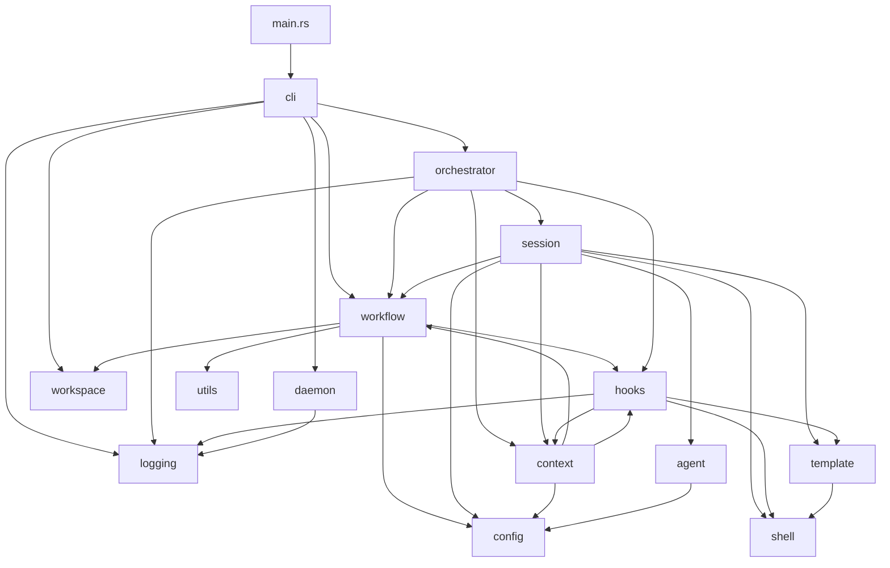
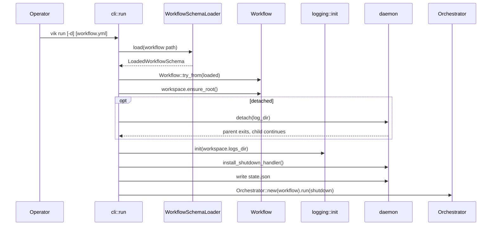

# Vik Architecture

This document describes current code. It is not a target design.

## Overview

Vik is one Rust binary crate. CLI startup loads `workflow.yml` into
`WorkflowSchema`, builds a `Workflow`, prepares the workflow-scoped workspace
root, installs logging, writes daemon state, and runs the event-driven
orchestrator.

The orchestrator owns running-stage state. Intake, issue setup, stage launch,
session monitoring, and hook execution run in background tasks and report back
through typed channels.

There is no `src/server/` module today. HTTP API docs describe planned work, not
current runtime behavior.

## Folder Structure

```text
src/
|-- main.rs          binary entry
|-- cli/             clap parsing and subcommand execution
|-- config/          workflow.yml serde types and diagnostics
|-- workflow/        runtime supervisor built from loaded schema
|-- workspace/       workflow-scoped workspace path layout
|-- logging/         tracing subscriber, phases, spans, retention
|-- shell/           CommandExt wrapper for timeout and cancellation
|-- template/        MiniJinja renderer plus prompt command expansion
|-- agent/           AgentAdapter trait, Codex and Claude Code adapters
|-- session/         session spawn, event stream, snapshots, JSONL writer
|-- hooks/           after_create, before_run, after_run shell hooks
|-- orchestrator/    intake loop, dispatch, running map, launch, monitor
|-- daemon/          detach, signals, lifecycle, state file
|-- context/         issue intake data and issue-run runtime context
`-- utils/           shared path helpers
```

Layout rules:

- Multi-file modules use `<name>/mod.rs`.
- Single-file leaves may stay as `<name>.rs`.
- Vik-owned path derivation belongs in `src/workspace/`.
- Platform detach and signal code belongs under `src/daemon/{detach,signals}/`.

## Layer Map



Important current boundaries:

- `orchestrator` does not import `agent` or `shell`.
- `agent` adapters do not spawn subprocesses directly.
- `SessionFactory` is the orchestrator-to-session spawn seam.
- `Workflow` is the path/config carrier passed into runtime layers.
- `Workspace` accessors produce logs, sessions, service, and issue paths.
- `IssueRun` owns issue workspace preparation and `after_create`.
- `IssueStage` carries issue run context, stage schema, and session log path.

## Startup



`--port` resolves a socket address, but the server path is `todo!` today.

## Orchestrator Runtime

`Orchestrator::run` starts one `IntakeLoop` task and then selects over:

- shutdown token
- orchestrator event channel

Main loop owns `RunningMap`. It reserves stage keys before async setup starts.
Reserved stages have no `Session` yet. The concurrency cap counts distinct
issue ids, not stage count. Other tasks send events:

- `IntakeEvent::Issue`
- `IntakeEvent::Failed`
- `IntakeEvent::Stopped`
- `StageEvent::IssueReady`
- `StageEvent::Started`
- `StageEvent::Snapshot`
- `StageEvent::Terminal`
- `StageEvent::Failed`

Dispatch flow:

1. Intake emits an issue.
2. Orchestrator wraps it in `IssueRun` and matches stages by exact `state`.
3. Orchestrator reserves `(issue_id, stage_name)`.
4. Issue setup task ensures
   `<workflow-workspace-root>/issues/<issue_id>/` exists.
5. If setup created the issue workspace, it runs `after_create`; existing
   issue workspaces skip `after_create`.
6. Launcher task runs `before_run`.
7. Launcher spawns a `Session` with the runtime `IssueStage`.
8. Monitor task sends snapshots and terminal event.
9. Launcher runs `after_run` after terminal state, except cancellation.

## Intake

`IntakeLoop` runs `issues.pull.command` from the workflow file directory, waits
for command completion, and parses stdout as `Issues(Vec<Issue>)` JSON.

The sleep between intake cycles is `issues.pull.idle_sec`.

## Session

`SessionFactory` holds `Arc<Workflow>` and resolves the agent profile for each
runtime `IssueStage`. Each spawned `Session` holds the `IssueStage` it is
executing.

Session spawn:

1. Resolve the stage prompt path through `IssueStage.workflow().resolve_path`.
2. Read the prompt file.
3. Render MiniJinja with serialized `IssueStage` context.
4. Expand prompt commands with ``!`exec(command)` ``.
5. Pick adapter with `agent::get_adapter(profile.runtime)`.
6. Build provider command.
7. Spawn the child process.
8. Stream stdout lines into adapter event mapping.
9. Write decoded `AgentEvent` JSONL.
10. Update `SessionSnapshot`.

Session logs live at:

```text
<workflow-workspace-root>/sessions/<issue.id>/<stage_name>-<uuid-v7>.jsonl
```

Current code uses a hardcoded one-hour child timeout. There is no stall
watchdog config in workflow schema.

## Agents

`AgentAdapter` has two methods:

- `build_command(&self, profile, prompt) -> AgentCommand`
- `map_event(&self, value) -> Vec<AgentEvent>`

`get_adapter(runtime)` returns a stateless adapter:

- `CodexAdapter`
- `ClaudeCodeAdapter`

`AgentProfileSchema.args` is forwarded into provider CLI flags before fixed
provider flags.

## Template Context

`JinjaRenderer::new()` captures process env under `env` and uses strict
undefined-variable behavior.

There is no `src/template/context.rs` module. Prompt and hook renderers pass
`Serialize` values directly into MiniJinja.

Runtime template contexts:

- `IssueRun` is used for `after_create`.
- `IssueStage` is used for stage `before_run`, stage `after_run`, and prompts.

Both serialize to the same current field shape:

- `workflow_path`
- `workspace_root`
- `issue`

The `issue` object contains:

- `id`, `title`, `description`, and `state`
- `workdir`
- extra issue payload fields from the pull command

`IssueStage` keeps stage name, stage schema, and log path for Rust callers. Its
current `Serialize` implementation delegates to `IssueRun`.

`JinjaRenderer` also adds process env under `env`. Bindings like `stage.name`,
`workspace.root`, `workflow`, `loop`, `profile`, `cwd`, and root-level issue
fields like `id` are not produced by current code.

## Hooks

`HookRunner` owns direct async methods:

- `after_issue_workdir_created`
- `before_issue_stage_run`
- `after_issue_stage_run`

Workflow field names remain `after_create`, `before_run`, and `after_run`.
Internal hook names used for logging are `after_issue_workdir_create`,
`before_issue_stage_run`, and `after_issue_stage_run`.

Hook execution:

1. Return `Ok(())` immediately when the hook body is missing.
2. Render with strict MiniJinja.
3. Run `sh -c` or `cmd /C` in the issue workspace.
4. Apply a hardcoded 30-second timeout.
5. Return `Result<(), HookError>`.

Hooks do not run prompt-command expansion.

## Workspace And State

The YAML `workspace.root` names a workspace home. `Workflow` resolves it against
the workflow file directory when relative, then appends
`workflows/<workflow-path-key>/`. `<workflow-path-key>` is the absolute workflow
file path with `/` replaced by `-`. `Workspace::ensure_root()` creates the
workflow-scoped root recursively when it is missing.

`Workspace` memoizes these path helpers:

- `root()`
- `logs_dir()`
- `sessions_dir()`
- `service_dir()`
- `service_state_file()`
- `issues_dir()`
- `issue_workdir(issue_id)`
- `issue_sessions_dir(issue_id)`

Runtime artifacts:

| path                                                       | owner    | purpose                   |
| ---------------------------------------------------------- | -------- | ------------------------- |
| `<root>/service/state.json`                                | daemon   | pid and lifecycle state   |
| `<root>/logs/vik.log.YYYY-MM-DD`                           | logging  | INFO+ log events          |
| `<root>/logs/vik-error.log.YYYY-MM-DD`                     | logging  | ERROR-only log events     |
| `<root>/sessions/<issue_id>/<stage_name>-<uuid-v7>.jsonl`  | session  | decoded AgentEvent stream |
| `<root>/issues/<issue_id>/`                                | operator | issue workspace           |

## Daemon

Daemon modules:

- `detach/`: Unix detach and Windows unsupported stub.
- `signals/`: SIGINT/SIGTERM/SIGHUP handling and pid liveness helpers.
- `state.rs`: atomic state JSON read/write/remove.
- `lifecycle.rs`: status, stop, restart stop phase, uninstall.

`stop` sends SIGTERM and waits up to 30 seconds for the daemon pid to exit.
The daemon itself cancels intake and running sessions when the shutdown token
trips.

## Where New Behavior Lands

| change                          | destination                                      |
| ------------------------------- | ------------------------------------------------ |
| new workflow field              | `src/config/`, then `Workflow` accessor if used  |
| new CLI subcommand              | `src/cli/<name>.rs` and `src/cli/mod.rs`         |
| new Vik-owned path              | `src/workspace/mod.rs`                           |
| new agent provider              | `src/agent/adapters/<provider>/` and `get_adapter` |
| new prompt or hook binding      | `src/context/run.rs` serialization or renderer call site |
| new hook trigger point          | `src/hooks/` plus orchestrator or launcher call site |
| HTTP API implementation         | new server module plus CLI `drive_runtime`       |

## Related Documents

- [`CONTEXT.md`](../../CONTEXT.md)
- [`PRD.md`](../PRD.md)
- [`code-conventions.md`](./code-conventions.md)
- [`review-checklist.md`](./review-checklist.md)
- [ADRs](../adr/)
